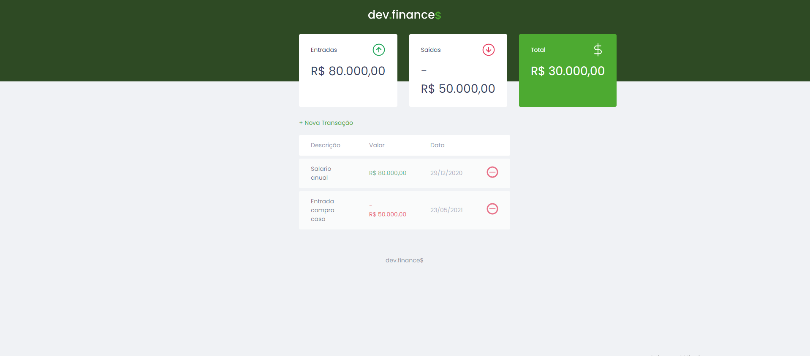
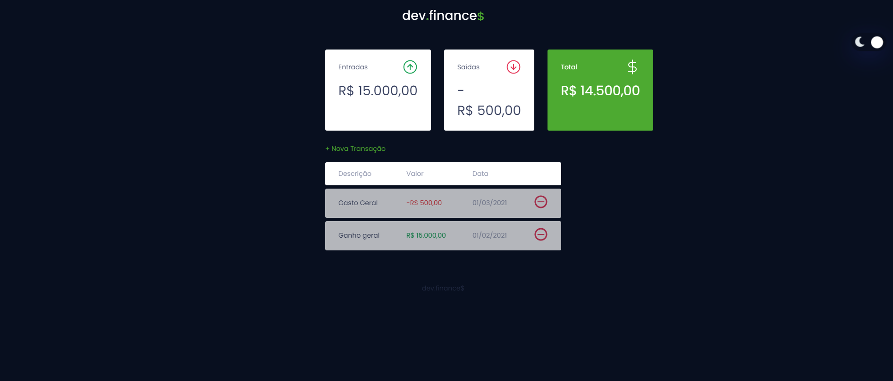

<h1 align="center">Dev.Finances</h1>

<h2 align="center">🍕 Um app de finanças, desenvolvido durante a Maratona Discovery...</h2>

<h4 align="center">🚧~Em construção🚧</h4>




___

## 💬 Sobre o projeto
Dev.Finances - É um projeto feito para adquirir conhecimentos ou atualiza-los em HTML, CSS e JS, com modo dark inserido.

Projeto desenvolvido durante a **MARATONA_DISCOVERY** oferecida pela [Rocketseat](https://app.rocketseat.com.br/).

___

## 🛸💻Tecnologias utilizadas
* [HTML](https://www.w3schools.com/html/)
* [JavaScript](https://nextjs.org)
* [MaratonaDiscovery](https://maratonadiscover.rocketseat.com.br/inscricao)
* [Nodejs](https://nodejs.org/en/)
* [CSS](https://www.w3schools.com/css/)
<br>
<br>

___

## 🚀 Como executar o projeto

- Antes de começar, você vai precisar ter instalado em sua máquina as seguintes ferramentas: [Git](https://git-scm.com), [Node.js](https://nodejs.org/en/). 
- E um editor para trabalhar com o código como [VSCode](https://code.visualstudio.com/).
- Instale **[Yarn](https://yarnpkg.com/)** para ter uma melhor experiência quando for executar a aplicação.

<br>

___

### :octocat: Faça o clone do projeto

```bash
# Clone este repositório
$ git clone <https://github.com/Gilles30/maratona-discovery-finance-app.git>

# Acesse a pasta do projeto no terminal/cmd
$ cd maratona-discovery-finance-app

```
___

### 💻 Rodando a aplicação web
```bash

# Click e rode direto
$ index.html

# Caso prefira, adicione e execute 
$ LiveServe

# O aplicação inciará (geralmente) na unidade c: com o caminho salvo da pasta>
```
___

## 👨🏻‍🚀 Sobre mim

  <a href="https://app.rocketseat.com.br/me/lorison-gilles">
  
  <br />
  <sub><b>Lorison Gilles</b></sub></a> <a href="https://app.rocketseat.com.br/me/lorison-gilles/" title="Rocketseat"></a>

 <br>
 <br>

[](https://www.linkedin.com/in/lorison-gilles/)

<br>
<br>

___
<br>
<br>

## 💜💙💙  Agradecimentos

Valew[Rocketseat e Mark Brito](https://www.rocketseat.com.br) por estar ajudando a comunidade sempre, Tmj🚀.

Um grande obrigado a esse cara que está sempre ajudando os Juninho e os estag... kkkk (brincadeira) Ajudando a toda comunidade dev do Brasil e do Mundo...

<table>
  <td align="center"><a href="https://app.rocketseat.com.br/me/maykbrito"><br /><sub><b>Mayk Brito</b></sub></a><br /><a href="https://app.rocketseat.com.br/me/maykbrito" title="Rocketseat"></a></td>
</table>
<br>
<br>
___

## Como contribuir

1. Faça um fork do projeto.
2. Crie um novo branch com suas alterações: `git checkout -b my-feature`
3. Salve suas alterações e crie uma mensagem de confirmação dizendo o que você fez: `git commit -m" feature: My new feature "`
4. Envie suas alterações: `git push origin my-feature`
   > Se você tiver alguma dúvida, consulte este guia [guide on how to contribute](./CONTRIBUTING.md)

---

